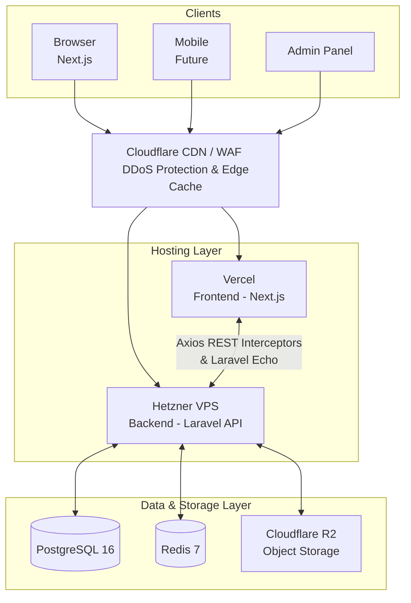

<div align="center">

# 🌊 Kadal2Kadaai 🐟

**A production-grade multi-vendor fish marketplace platform connecting Consumers, Fishermen, Fish Vendors, Delivery Partners, and Administrators.**

[](https://nextjs.org/)
[](https://reactjs.org/)
[](https://www.typescriptlang.org/)
[](https://tailwindcss.com/)
[](https://laravel.com/)
[](https://www.php.net/)
[](https://www.postgresql.org/)
[](https://redis.io/)

---

</div>

## 🏗 Architecture Overview

The platform uses a decoupled frontend/backend architecture, globally distributed via Cloudflare and Vercel, with a robust Laravel API hosted on Hetzner VPS.



## 🚀 Actual Technology Stack

| Layer | Technology |
|---|---|
| 🎨 **Frontend** | Next.js 16.2.7, React 19.2.4, TypeScript, Tailwind CSS 4, ShadCN UI, TanStack Query v5 |
| ⚙️ **Backend** | Laravel 13.8, PHP 8.3, REST API |
| 🗄️ **Database** | PostgreSQL 16 (UUIDs, Soft Deletes, Audit logging) |
| ⚡ **Cache & Queue** | Redis 7 (Laravel Horizon, Session state) |
| ☁️ **Storage** | Cloudflare R2 (S3-compatible API for images & documents) |
| 💳 **Payments** | Razorpay |
| 🔐 **Authentication**| Laravel Sanctum (Token-based), OTP, Google OAuth, Spatie RBAC |

## 🛠 Quick Start

> [!TIP]
> Make sure you have the following installed: **Node.js 20+**, **PHP 8.3+**, **Composer 2+**, **PostgreSQL 16**, **Redis 7**.

### Local Development

1️⃣ **Start Infrastructure**
```bash
docker-compose -f docker-compose.dev.yml up -d
```

2️⃣ **Backend Setup**
```bash
cd backend
cp .env.example .env
composer install
php artisan key:generate
php artisan migrate --seed
php artisan serve
```

3️⃣ **Frontend Setup**
```bash
cd frontend
cp .env.local.example .env.local
npm install
npm run dev
```

## 📚 Documentation

Navigate to the `docs` directory for detailed architecture, schema, and API guides:

- 📐 [Architecture](./docs/architecture.md)
- 🗂️ [Database Schema](./docs/database-schema.md)
- 🔌 [API Standards](./docs/api-standards.md)
- 💻 [Coding Standards](./docs/coding-standards.md)
- 🚀 [Deployment Guide](./docs/deployment.md)
- 🔒 [Security Checklist](./docs/security.md)

## 🌐 Applications & Portals

* 🛍️ **Consumer Marketplace** — Browse, order, and track fresh catches.
* 🛡️ **Admin Operations Portal** — Unified enterprise portal managing the platform, inventory, and analytics via RBAC.

## 📊 Development Status

> [!IMPORTANT]
> All codebase changes are actively synced with the official GitHub repository, maintaining the latest local state on the `main` branch. A comprehensive [HOWTORUN.md](./HOWTORUN.md) guide has been provided for streamlined local deployments.

**Phase Progress**
- ✅ Foundation Phase
- ✅ Authentication Phase
- ✅ Localhost Boot Phase
- ✅ UI Phases 1-6
- ✅ Phase 8 Certification
- ✅ Phase 9 Architecture
- 🟢 **Phase 10: Live Consumer Marketplace UI** (Active)

Currently, the **Operations Portal (Admin and Seller)** is fully built, utilizing real-time API hooks and connected directly to the Laravel backend. The application is configured for cloud deployment (Vercel + Docker on Render).

---
<div align="center">
<i>Built with ❤️ for the fishing community.</i>
</div>
